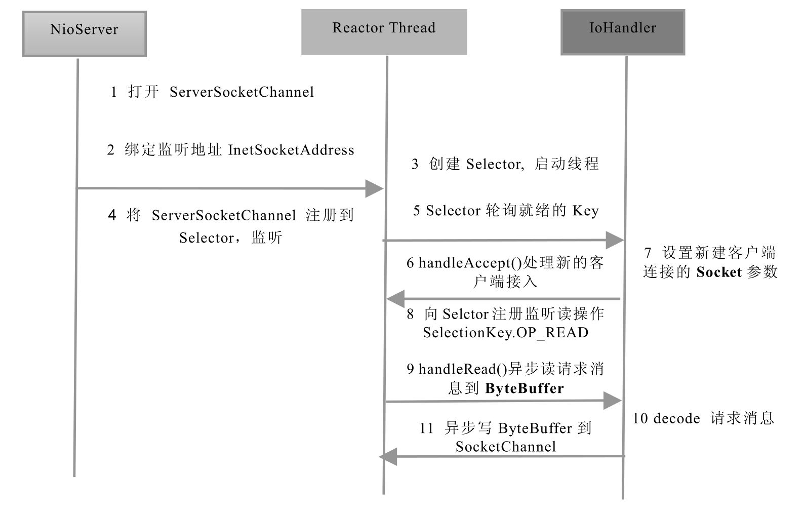

# 简介

官方称为New I/O，原因在于它相对于之前的I/O类库是新增的。但是，更多的人喜欢称之为非阻塞I/O（Non-block I/O）。


1.缓冲区Buffer

Buffer是一个对象，它包含一些要写入或者要读出的数据。在面向流的I/O中，可以将数据直接写入或者将数据直接读到Stream对象中。在NIO库中，所有数据都是用缓冲区处理的。在读取数据时，它是直接读到缓冲区中的；在写入数据时，写入到缓冲区中。任何时候访问NIO中的数据，都是通过缓冲区进行操作。

在NIO库中，所有数据都是用缓冲区处理的。在读取数据时，它是直接读到缓冲区中的；在写入数据时，写入到缓冲区中。任何时候访问NIO中的数据，都是通过缓冲区进行操作。

缓冲区实质上是一个数组。通常它是一个字节数组（ByteBuffer），也可以使用其他种类的数组。但是一个缓冲区不仅仅是一个数组，缓冲区提供了对数据的结构化访问以及维护读写位置（limit）等信息。

最常用的缓冲区是ByteBuffer，一个ByteBuffer提供了一组功能用于操作byte数组。除了ByteBuffer，还有其他的一些缓冲区，事实上，每一种Java基本类型（除了Boolean类型）都对应有一种缓冲区，具体如下。


◎ ByteBuffer：字节缓冲区
◎ CharBuffer：字符缓冲区
◎ ShortBuffer：短整型缓冲区
◎ IntBuffer：整形缓冲区
◎ LongBuffer：长整形缓冲区
◎ FloatBuffer：浮点型缓冲区
◎ DoubleBuffer：双精度浮点型缓冲区


2.通道Channel

Channel是一个通道，它就像自来水管一样，网络数据通过Channel读取和写入。通道与流的不同之处在于通道是双向的，流只是在一个方向上移动（一个流必须是InputStream或者OutputStream的子类），而通道可以用于读、写或者二者同时进行。

因为Channel是全双工的，所以它可以比流更好地映射底层操作系统的API。特别是在UNIX网络编程模型中，底层操作系统的通道都是全双工的，同时支持读写操作。

自顶向下看，前三层主要是Channel接口，用于定义它的功能，后面是一些具体的功能类（抽象类）。从类图可以看出，实际上Channel可以分为两大类：用于网络读写的SelectableChannel和用于文件操作的FileChannel。

Channel的类图继承关系如图2-9所示。

自顶向下看，前三层主要是Channel接口，用于定义它的功能，后面是一些具体的功能类（抽象类）。从类图可以看出，实际上Channel可以分为两大类：用于网络读写的SelectableChannel和用于文件操作的FileChannel。

3.多路复用器Selector

多路复用器提供选择已经就绪的任务的能力。简单来讲，Selector会不断地轮询注册在其上的Channel，如果某个Channel上面发生读或者写事件，这个Channel就处于就绪状态，会被Selector轮询出来，然后通过SelectionKey可以获取就绪Channel的集合，进行后续的I/O操作。一个多路复用器Selector可以同时轮询多个Channel，由于JDK使用了epoll（）代替传统的select实现，所以它并没有最大连接句柄1024/2048的限制。这也就意味着只需要一个线程负责Selector的轮询，就可以接入成千上万的客户端，这确实是个非常巨大的进步。


步骤一：打开ServerSocketChannel，用于监听客户端的连接，它是所有客户端连接的父管道
```java

```
