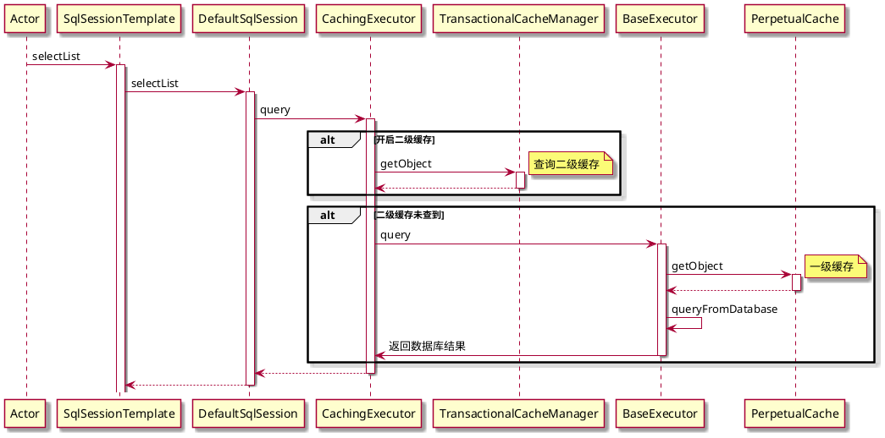

# 缓存



## 禁用二级缓存
`@Options(useCache = false)`
```java
@Select("select * from ht")
@Options(useCache = false)
List<Map> select();

```
## 在debug代码时发现明明是一个接口生成代理类，为什么打印的是一个实现类。


- IDEA在debug程序时，当debug到某个对象时，会调用对象的toString()方法，用来在debug界面显示对象信息。
- IDEA调用toString()方法时，即使在toString()方法中设置了断点，该断点也不会被触发，也就是说，开发者多数情况下不会知道toString()方法被调用了
- 多数情况下调用一下toString()方法没有什么问题，但是也有例外，比如重写了toString()方法的类，随意的调用toString()方法会导致未知的问题。

可以看到我们代理类的 `toString()` 方法调用的时候，会自动获取目标对象`DefaultSqlSession`，所以debug的时候看到`DefaultSqlSession`


## 解决办法
我们把自动`toString()`关闭就好了 

再次运行发现正常了，`toString()`需要自己点击了

